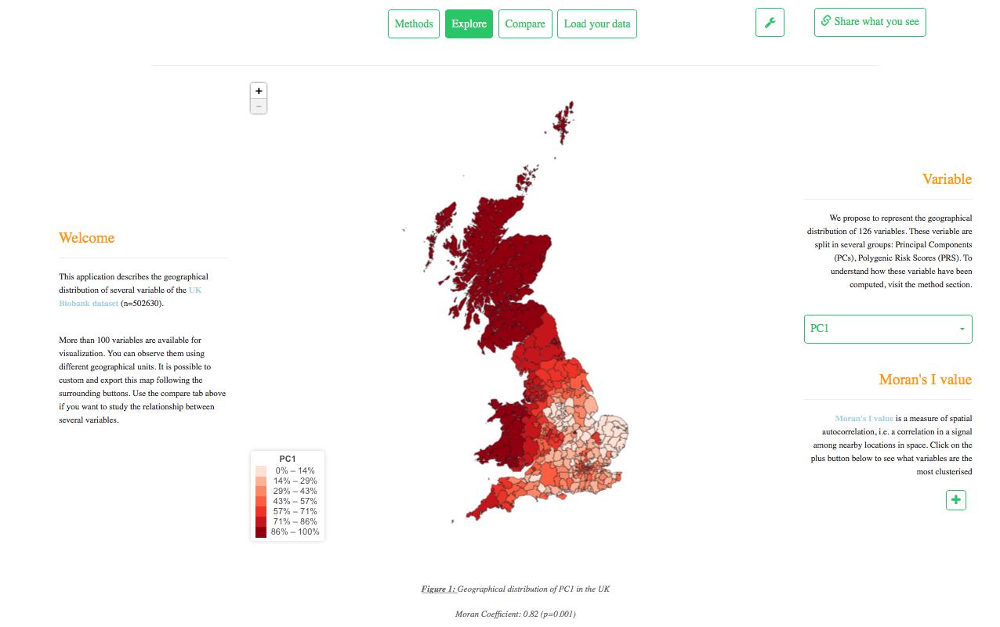

UKB geographical analysis
===================


Overview
--------
This repository gives the code of a web application that allows to interactively explore a few geographical components of the UK Biobank. 

Here is a screenshot of one of the multiple visualizations proposed in the website:



How to use the application
--------
The best way to use this application is via its online version. (Link not publically available yet).

If you really want to use this application locally you can type in R:

```
library(shiny)
runGitHub("holtzy/UKB_geo_application")
```

It should install all the requested libraries and launch the application.


Citing 
--------
The associated paper is currently work in progress. 


About us
--------

Abdel
Yan Holtz: [homepage](https://holtzyan.wordpress.com)  
  

